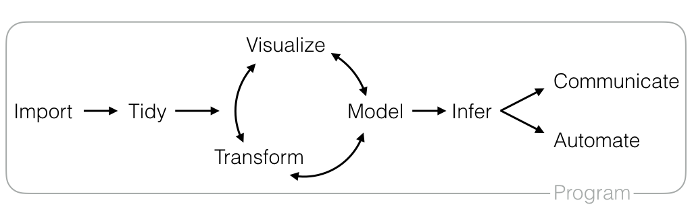

RStartHere
==========

A guide to some of the most useful R Packages that we know about, organized by their role in data science.

[Click here to suggest packages.](https://github.com/rstudio/RStartHere/edit/master/README.Rmd)

Data Science Workflow
---------------------

Each data science project is different, but each follows the same general steps. You:

1.  [Import](#import) your data into R
2.  [Tidy](#tidy) it
3.  Understand your data by iteratively
    1.  [visualizing](#visualize)
    2.  [tranforming](#transform) and
    3.  [modeling](#modelinfer) your data

4.  [Infer](#infer) how your understanding applies to other data sets (*including future data, i.e. predictions*)
5.  [Communicate](#communicate) your results to an audience, or
6.  [Automate](#automate) your analysis for easy reuse
7.  [Program](#program) the whole way through, since you do each of these things on a computer

Below we list the most useful R packages that we know of for each step.

Import
------

These packages help you import data into R and save data.

-   [feather](https://blog.rstudio.org/2016/03/29/feather/) - a fast, lightweight file format used by both R and Python
-   [readr](https://blog.rstudio.org/2015/10/28/readr-0-2-0/) - reads tabular data
-   [readxl](https://blog.rstudio.org/2015/04/15/readxl-0-1-0/) - reads Microsoft Excel spreadsheets
-   [openxlsx](https://github.com/awalker89/openxlsx) - reads Microsoft Excel spreadsheets
-   [googlesheets](https://github.com/jennybc/googlesheets) - reads Google spreadsheets
-   [haven](https://blog.rstudio.org/2015/03/04/haven-0-1-0/) - reads SAS, SPSS, and Stata files
-   [httr](https://blog.rstudio.org/2016/02/02/httr-1-1-0/) - reads data from web APIs
-   [rvest](https://blog.rstudio.org/2014/11/24/rvest-easy-web-scraping-with-r/) - scrapes data from web pages
-   [xml2](https://github.com/hadley/xml2) - reads HTML and XML data
-   [webreadr](https://cran.r-project.org/web/packages/webreadr/vignettes/Introduction.html) - reads common web log formats
-   [DBI](https://github.com/rstats-db/DBI) - a universal interface to database management systems (DBMS)
    -   [RMySQL](https://github.com/rstats-db/RMySQL) - MySQL driver for DBI
    -   [RPostgres](https://github.com/rstats-db/RPostgres) - Postgres driver for DBI
    -   [RSQLite](https://github.com/rstats-db/RSQLite) - SQlite driver for DBI
    -   [bigrquery](https://github.com/rstats-db/bigrquery) - Google BigQuery driver for DBI
-   [PivotalR](https://github.com/pivotalsoftware/PivotalR) - reads data from Pivitol (Greenplum) and HAWQ databases
-   [dplyr](https://github.com/hadley/dplyr) - contains an interface to common databases
-   [data.table](https://github.com/Rdatatable/data.table) - `fread()` for fast table reading
-   [git2r](https://github.com/ropensci/git2r) - tools to access git repositories

Tidy
----

These packages help you wrangle your data into a form that is easy to analyze in R.

-   [tidyr](https://github.com/hadley/tidyr) - tools for tidying layout of tabular data
-   [dplyr](https://github.com/hadley/dplyr) - tools for joining multiple tables into a tidy data set
-   [purrr](https://github.com/hadley/purrr) - tools for applying R functions to data structures, very useful when tidying
-   [broom](http://varianceexplained.org/r/broom-intro/) - tools for tidying statistical models into data frames
-   [zoo](https://www.google.com/webhp?sourceid=chrome-instant&ion=1&espv=2&ie=UTF-8#q=r%20zoo) - data structures for time series data

Visualize
---------

These packages help you visualize your data.

-   [ggplot2](http://docs.ggplot2.org/current/) with [extensions](http://www.ggplot2-exts.org/) - a versatile system for making plots
    -   [ggthemes](https://github.com/jrnold/ggthemes) - plot style themes
    -   [ggmap](https://github.com/dkahle/ggmap) - maps with Google Maps, Open Street Maps, etc.
    -   [ggiraph](http://davidgohel.github.io/ggiraph/introduction.html) - interactive ggplots
    -   [ggstance](https://github.com/lionel-/ggstance) - horizontal versions of common plots
    -   [GGally](https://github.com/ggobi/ggally) - scatterplot matrices
    -   [ggalt](https://github.com/hrbrmstr/ggalt) - additional coordinate systems, geoms, etc.
    -   [ggforce](https://github.com/thomasp85/ggforce) - additional geoms, etc.
    -   [ggrepel](https://github.com/slowkow/ggrepel) - prevent plot labels from overlapping
    -   [ggraph](https://github.com/thomasp85/ggraph) - graphs, networks, trees and more
    -   [ggpmisc](https://cran.rstudio.com/web/packages/ggpmisc/) - photo-biology related extensions
    -   [geomnet](https://github.com/sctyner/geomnet) - network visualization
    -   [ggExtra](https://github.com/daattali/ggExtra) - marginal histograms for a plot
    -   [gganimate](https://github.com/dgrtwo/gganimate) - animations
    -   [plotROC](https://github.com/sachsmc/plotROC) - interactive ROC plots
    -   [ggspectra](https://cran.rstudio.com/web/packages/ggspectra/) - tools for plotting light spectra
    -   [ggnetwork](https://github.com/briatte/ggnetwork) - geoms to plot networks
    -   [ggtech](https://github.com/ricardo-bion/ggtech) - style themes for plots
    -   [ggradar](https://github.com/ricardo-bion/ggradar) - radar charts
    -   [ggTimeSeries](https://github.com/Ather-Energy/ggTimeSeries) - time series visualizations
    -   [ggtree](https://bioconductor.org/packages/release/bioc/html/ggtree.html) - tree visualizations
    -   [ggseas](https://github.com/ellisp/ggseas) - seasonal adjustment tools
-   [lattice](http://lattice.r-forge.r-project.org/) - Trellis graphics
-   [rgl](https://cran.r-project.org/web/packages/rgl/vignettes/rgl.html) - interactive 3D plots
-   [ggvis](http://ggvis.rstudio.com/) - versatile system for interactive graphs
-   [htmlwidgets](http://www.htmlwidgets.org/) - framework for creating JavaScript widgets with R
    -   [leaflet](http://rstudio.github.io/leaflet/) - Interactive maps
    -   [dygraphs](http://rstudio.github.io/dygraphs) - Interactive time series plots
    -   [plotly](https://plot.ly/r/) - Interactive plots
    -   [rbokeh](http://hafen.github.io/rbokeh) - Interactive Bokeh plots
    -   [Highcharter](http://jkunst.com/highcharter/) - Interactive Highcharts plots
    -   [visNetwork](http://dataknowledge.github.io/visNetwork) - Interactive network graphs
    -   [networkD3](http://christophergandrud.github.io/networkD3/) - Interative d3 network graphs
    -   [d3heatmap](https://github.com/rstudio/d3heatmap) - Interactive d3 heatmaps
    -   [DT](http://rstudio.github.io/DT/) - Interactive tables
    -   [threejs](https://github.com/bwlewis/rthreejs) - Interactive 3d plots and globes
    -   [rglwidget](http://cran.at.r-project.org/web/packages/rglwidget/index.html) - Interactive 3d plot
    -   [DiagrammeR](http://rich-iannone.github.io/DiagrammeR/) - Interactive diagrams
    -   [MetricsGraphics](http://hrbrmstr.github.io/metricsgraphics/) - Interactive MetricsGraphics plots
-   [rCharts](http://rcharts.io/) - many interactive JavaScript visualizations
-   [coefplot](http://github.com/jaredlander/coefplot) - visualizes model statistics
-   [quantmod](http://www.quantmod.com/) - candlestick financial charts
-   [colorspace](https://cran.r-project.org/web/packages/colorspace/vignettes/hcl-colors.pdf) - HSL based color palettes
-   [viridis](https://github.com/sjmgarnier/viridis) - Matplotlib viridis color pallete for R
-   [munsell](https://github.com/cwickham/munsell) - Munsell color palettes for R.
-   RColorBrewer - color palettes for plots. No manual or website.
-   dichromat - color-blind friendly palettes. No manual or website.
-   [igraph](http://igraph.org/) - Network Analysis and Visualization
-   [latticeExtra](http://latticeextra.r-forge.r-project.org/) - Extensions for lattice graphics
-   [sp](https://github.com/edzer/sp/) - tools for spatial data

Transform
---------

These packages help you transform your data into new types of data.

-   [dplyr](https://github.com/hadley/dplyr) - a grammar of data transformation
-   [magrittr](https://github.com/smbache/magrittr) - a concise syntax for calling sequences of functions
-   [tibble](https://github.com/hadley/tibble) - efficient display structure for tabular data
-   [stringr](https://blog.rstudio.org/2015/05/05/stringr-1-0-0/) - tools for working with strings and regular expressions
-   [lubridate](https://cran.r-project.org/web/packages/lubridate/vignettes/lubridate.html) - tools for working with dates and times
-   [xts](http://r-forge.r-project.org/projects/xts) - tools for time series based data
-   [data.table](https://github.com/Rdatatable/data.table/wiki) - fast data manipulation
-   [vtreat](https://github.com/WinVector/vtreat) - tools for pre-processing variables for predictive modeling
-   [stringi](http://www.rexamine.com/resources/stringi/) - fast string processing facilities.
-   [Matrix](http://matrix.r-forge.r-project.org/) - LAPACK methods for dense and sparse matrix operations

Model/Infer
-----------

These packages help you build models and make inferences. Often the same packages will focus on both topics.

-   [car](https://r-forge.r-project.org/projects/car/) - functions from An R Companion to Applied Regression
-   [Hmisc](https://github.com/harrelfe/Hmisc) - miscellaneous functions for data analysis
-   [multcomp](http://multcomp.r-forge.r-project.org/) - Simultaneous Inference in General Parametric Models
-   [pbkrtest](http://people.math.aau.dk/~sorenh/software/pbkrtest/) - parametric bootstrap test for linear mixed effects models
-   [mvtnorm](http://mvtnorm.r-forge.r-project.org/) - Multivariate Normal and t Distributions
-   [MatrixModels](http://matrix.r-forge.r-project.org/) - Modelling with Sparse And Dense Matrices
-   [SparseM](http://www.econ.uiuc.edu/~roger/research/sparse/sparse.html) - linear algebra for sparse matrices
-   [lme4](https://github.com/lme4/lme4) - Linear Mixed-Effects Models using Eigen C++ library
-   [broom](http://varianceexplained.org/r/broom-intro/) - tools for tidying statistical models into data frames
-   [caret](http://topepo.github.io/caret/index.html) - tools for Classification And REgression Training
-   [glmnet](https://web.stanford.edu/~hastie/glmnet/glmnet_alpha.html) - generalized linear models via penalized maximum likelihood
-   [mosaic](http://mosaic-web.org/) - Tools for teaching mathematics, statistics, computation and modeling
-   [gbm](https://github.com/gbm-developers/gbm) - gradient boosted regression models
-   [xgboost](https://github.com/dmlc/xgboost) - Extreme Gradient Boosting
-   [randomForest](https://www.stat.berkeley.edu/~breiman/RandomForests/) - Random Forests for Classification and Regression
-   [ranger](https://github.com/imbs-hl/ranger) - a fast implementation of Random Forests
-   [h2o](http://www.h2o.ai/) - parallel distributed machine learning algorithms
-   [ROCR](http://rocr.bioinf.mpi-sb.mpg.de/) - plots to visualize classifier performance
-   [pROC](http://web.expasy.org/pROC/) - Tools for visualizing, smoothing and comparing ROC curves

Communicate
-----------

These packages help you communicate the results of data science to your audiences.

-   [rmarkdown](http://rmarkdown.rstudio.com/) - easy-to-use format for reproducible reports and dynamic documents in R
-   [knitr](http://yihui.name/knitr/) - embed R code within pdf and html reports
-   [flexdashboard](http://rstudio.github.io/flexdashboard/) - easy-to-create dashboards based on rmarkdown
-   [bookdown](https://bookdown.org/) - books and long documents built on R Markdown
-   [rticles](https://github.com/rstudio/rticles) - ready to use R Markdown templates
-   [tufte](http://rstudio.github.io/tufte/) - Tufte handout R Markdown template
-   [DT](http://rstudio.github.io/DT/) - Interactive data tables
-   [pixiedust](https://github.com/nutterb/pixiedust) - Customized tables
-   [xtable](https://cran.r-project.org/web/packages/xtable/vignettes/xtableGallery.pdf) - Customized tables
-   [highr](https://github.com/yihui/highr) - Syntax Highlighting for R Source Code
-   [formatR](http://yihui.name/formatR/) - `tidy_source()` to format R source code
-   [yaml](https://github.com/viking/r-yaml) - Methods to convert R data to YAML and back

Automate
--------

These packages help you create data science products that automate your analyses.

-   [shiny](http://shiny.rstudio.com/) - tools to make interactive web apps with R
    -   [shinydashboard](http://rstudio.github.io/shinydashboard/) - interactive dashboards with R
    -   [shinythemes](http://rstudio.github.io/shinythemes/) - style themes for Shiny apps
    -   [shinyAce](http://trestletech.github.io/shinyAce/) - Ace text editor for Shiny apps
    -   [shinyjs](https://github.com/daattali/shinyjs/blob/master/README.md) - adds common JavaScript operations to Shiny apps
    -   [miniUI](https://github.com/rstudio/miniUI) - UI elements for Shiny gadgets, interactive apps integrated into the R commandline workflow
    -   [shinyapps.io](https://www.shinyapps.io/) - hosting service for Shiny apps
    -   [Shiny Server Open Source](https://www.rstudio.com/products/shiny/shiny-server/) - OS server to host Shiny apps
    -   [Shiny Server Pro](https://www.rstudio.com/products/shiny/shiny-server/) - server to host Shiny apps enhanced with features for business enterprises
-   [rsconnect](http://shiny.rstudio.com/articles/shinyapps.html) - deploys Shiny apps to [shinyapps.io](https://www.shinyapps.io/)
-   [plumber](http://plumber.trestletech.com/) - converts R code to a web API
-   [rmarkdown](http://rmarkdown.rstudio.com/) - easy-to-use format for reproducible reports and dynamic documents in R
-   [rstudioapi](https://github.com/rstudio/rstudioapi) - safely access RStudio IDE's API

### Program

These packages make it easier to program with the R language.

-   [RStudio Desktop IDE](https://www.rstudio.com/products/rstudio/#Desktop) - IDE application for R
-   [RStudio Server Open Source](https://www.rstudio.com/products/rstudio/#Server)
-   server based IDE for R
-   [RStudio Server Professional](https://www.rstudio.com/products/rstudio/#Server) - server based IDE for R enhanced with features for business enterprises
-   [devtools](https://github.com/hadley/devtools) - tools that make it easier to develop R packages
-   [packrat](https://rstudio.github.io/packrat/) - creates project specific libraries, which handle package versioning and enhance reproducibility
-   [drat](https://github.com/eddelbuettel/drat) - tools to create and use alternative R package repositories
-   [testthat](https://journal.r-project.org/archive/2011-1/RJournal_2011-1_Wickham.pdf) - easy-to-use system for unit testing packages
-   [roxygen2](https://github.com/klutometis/roxygen) - easy-to-use method for documenting packages
-   [purrr](https://github.com/hadley/purrr) - tools for applying R functions to data structures
-   [profvis](https://github.com/rstudio/profvis) - visualizes code profiling data from R
-   [Rcpp](http://www.rcpp.org/) - C++ API for R
-   [R6](https://github.com/wch/R6) - fast, simple object class that uses reference semantics
-   [htmltools](https://github.com/rstudio/htmltools) - Tools for HTML generation and output
-   [nloptr](https://github.com/jyypma/nloptr) - interface to NLopt non-linear optimization library.
-   [minqa](http://optimizer.r-forge.r-project.org/) - optimization algorithms.
-   [rngtools](http://renozao.github.io/rngtools/) - Utilities for working with Random Number Generators
-   [NMF](http://renozao.github.io/NMF/) - Nonnegative Matrix Factorization
-   [crayon](https://github.com/gaborcsardi/crayon) - Adds color to terminal output
-   [RJSONIO](https://github.com/duncantl/RJSONIO) - convert R objects to JSON notation
-   [jsonlite](https://github.com/jeroenooms/jsonlite) - a fast JSON parser and generator for R
-   [RcppArmadillo](https://github.com/RcppCore/RcppArmadillo) - interface to 'Armadillo' Templated Linear Algebra Library

Data
----

These packages contain data sets to use as training data or toy examples.

-   [babynames](https://github.com/hadley/babynames) - Names given to US babies 1880-2014
-   [neiss](https://github.com/hadley/neiss) - sample of all accidents reported to US emergency rooms 2009-2014
-   [yrbss](https://github.com/hadley/yrbss) - Youth Risk Behaviour Surveillance System data from 1991 to 2013
-   [nycflights13](https://github.com/hadley/nycflights13) - all out-bound flights from NYC in 2013
-   [hflights](https://github.com/hadley/hflights) - flights departing Houston in 2011
-   [USAboundaries](https://github.com/ropensci/USAboundaries) - Historical and Contemporary Boundaries of the United States of America
-   [rworldmap](https://github.com/AndySouth/rworldmap) - country border data
-   [usdanutrients](https://github.com/hadley/usdanutrients) - USDA nutrient database
-   [fueleconomy](https://github.com/hadley/fueleconomy) - EPA fuel economy data
-   [nasaweather](https://github.com/hadley/nasaweather) - geographic and atmospheric measures on a very coarse 24 by 24 grid covering Central America
-   [mexico-mortality](https://github.com/hadley/mexico-mortality) - deaths in Mexico
-   [data-movies](https://github.com/hadley/data-movies) and [ggplotmovies](https://cran.r-project.org/web/packages/ggplot2movies/) - data from the Internet Movie Database (IMDB)
-   [pop-flows](https://github.com/hadley/pop-flows) - Population flows around the USA in 2008
-   [data-housing-crisis](https://github.com/hadley/data-housing-crisis) - Clean data related to the 2008 US housing crisis
-   [gun-sales](https://github.com/NYTimes/gunsales) - Statistical analysis of monthly background checks of gun purchases from NY times
-   [stationaRy](https://github.com/rich-iannone/stationaRy) - hourly meteorological data from one of thousands of global stations
-   [gapminder](https://github.com/jennybc/gapminder) - Excerpt from the Gapminder data
-   [janeaustenr](https://github.com/juliasilge/janeaustenr) - Jane Austen's Complete Novels

Criteria
--------

What makes an R Package useful? A useful R package should perform a useful task, and it should do it well. Here are some criteria that we used to make the list.

-   The code in the package runs fast, with few errors.
-   The code in the package has an intuitive syntax that is easy to remember.
-   The package plays well with other packages; you do not need to munge your data into new forms to use the package.
-   The package is widely used and recommended by its users.
-   The package has a development website, or series of vignettes, that make the package easy to learn.
-   The package is developed in the open (e.g. on Github or RForge).
-   The package uses tests to ensure that it will be stable and bug free well into the future.
-   The package is stable and available from CRAN, or we are personally involved with the package and committed to its development.

For other useful choices, please check out our list of [popular packages that did not quite meet these criteria](runners-up.md).

You can learn more about packages in R with the [CRAN task views](https://cran.r-project.org/web/views/).
